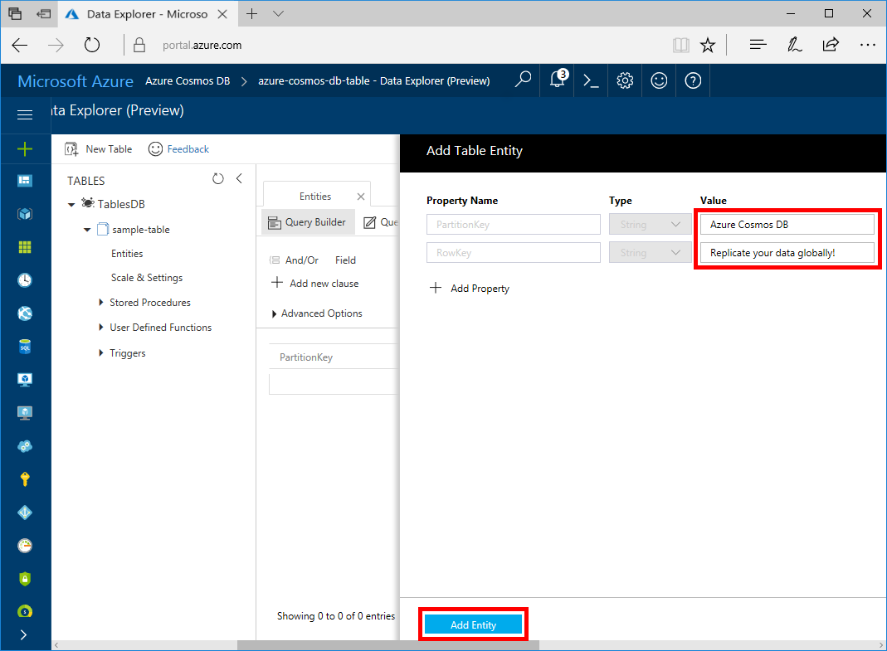
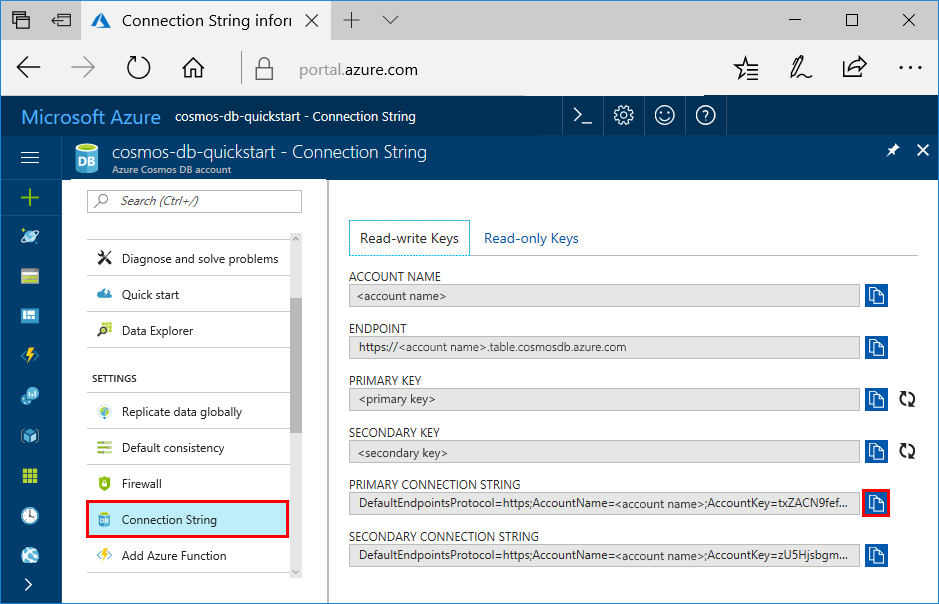

# Quickstart: Build a Table API app with .NET and Azure Cosmos DB 

This quickstart shows how to use Java and the Azure Cosmos DB [Table API](table-introduction.md) to build an app by cloning an example from GitHub. This quickstart also shows you how to create an Azure Cosmos DB account and how to use Data Explorer to create tables and entities in the web-based Azure portal.

Azure Cosmos DB is Microsoft’s globally distributed multi-model database service. You can quickly create and query document, key/value, and graph databases, all of which benefit from the global distribution and horizontal scale capabilities at the core of Azure Cosmos DB. 

## Prerequisites

If you don’t already have Visual Studio 2017 installed, you can download and use the **free** [Visual Studio 2017 Community Edition](https://www.visualstudio.com/downloads/). Make sure that you enable **Azure development** during the Visual Studio setup.

[!INCLUDE [quickstarts-free-trial-note](../../includes/quickstarts-free-trial-note.md)]

## Create a database account

[!INCLUDE [cosmos-db-create-dbaccount-table](../../includes/cosmos-db-create-dbaccount-table.md)]

## Add a table

[!INCLUDE [cosmos-db-create-table](../../includes/cosmos-db-create-table.md)]

## Add sample data

You can now add data to your new table using Data Explorer.

1. In Data Explorer, expand **sample-table**, click **Entities**, and then click **Add Entity**.

   
2. Now add data to the PartitionKey value box and RowKey value boxes, and click **Add Entity**.

   
  
    You can now add more entities to your table, edit your entities, or query your data in Data Explorer. Data Explorer is also where you can scale your throughput and add stored procedures, user defined functions, and triggers to your table.

## Clone the sample application

Now let's clone a Table app from github, set the connection string, and run it. You'll see how easy it is to work with data programmatically. 

1. Open a git terminal window, such as git bash, and use the `cd` command to change to a folder to install the sample app. 

    ```bash
    cd "C:\git-samples"
    ```

2. Run the following command to clone the sample repository. This command creates a copy of the sample app on your computer. 

    ```bash
    git clone https://github.com/Azure-Samples/storage-table-dotnet-getting-started.git
    ```

3. Then open the TableStorage solution file in Visual Studio. 

## Update your connection string

Now go back to the Azure portal to get your connection string information and copy it into the app. This enables your app to communicate with your hosted database. 

1. In the [Azure portal](http://portal.azure.com/), click **Connection String**. 

    Use the copy buttons on the right side of the screen to copy the PRIMARY CONNECTION STRING.

    

2. In Visual Studio, open the App.config file. 

3. Uncomment the StorageConnectionString on line 8 and comment out the StorageConnectionString on line 7 as this tutorial does not use the Storage Emulator. Line 7 and 8 should now look like this:

    ```
    <!--key="StorageConnectionString" value="UseDevelopmentStorage=true;" />-->
    <add key="StorageConnectionString" value="DefaultEndpointsProtocol=https;AccountName=[AccountName];AccountKey=[AccountKey]" />
    ```

4. Paste the PRIMARY CONNECTION STRING from the portal into the StorageConnectionString value on line 8. Paste the string inside the quotes. If your Endpoint uses documents.azure.com, change that portion to table.cosmosdb.azure.com. 

    Line 8 should now look similar to:

    ```
    <add key="StorageConnectionString" value="DefaultEndpointsProtocol=https;AccountName=<account name>;AccountKey=txZACN9f...==;TableEndpoint=https://<account name>.table.cosmosdb.azure.com;" />
    ```

4. Save the App.config file.

You've now updated your app with all the info it needs to communicate with Azure Cosmos DB. 

## Build and deploy the app

1. In Visual Studio, right-click on the **TableStorage** project in **Solution Explorer** and then click **Manage NuGet Packages**. 

2. In the NuGet **Browse** box, type *Microsoft.Azure.CosmosDB.Table*.

3. From the results, install the **Microsoft.Azure.CosmosDB.Table** library. This installs the Azure Cosmos DB Table API package as well as all dependencies.

4. Open BasicSamples.cs and add a breakpoint to line 30 and line 52.

5. Click CTRL + F5 to run the application.

    The console window displays the table data being added to the new table database in Azure Cosmos DB. 
    
    If you get an error about dependencies, see [Troubleshooting](table-sdk-dotnet.md#troubleshooting).

    When you hit the first breakpoint, go back to Data Explorer in the Azure portal and expand the demo* table and click **Entities**. The **Entities** tab on the right shows the new entity that was added, note that phone number for the user is 425-555-0101.
    
6. Close the Entities tab in Data Explorer.
    
7. Continue to run the app to the next breakpoint.

    When you hit the breakpoint, switch back to the portal, click Entities again to open the Entities tab, and note that the phone number has been updated to 425-555-0105.

8. Back in the console window, press CTRL + C to end the execution of the app. 

    You can now go back to Data Explorer and add or modify the entitites, and query the data.

## Review SLAs in the Azure portal

[!INCLUDE [cosmosdb-tutorial-review-slas](../../includes/cosmos-db-tutorial-review-slas.md)]

## Clean up resources

[!INCLUDE [cosmosdb-delete-resource-group](../../includes/cosmos-db-delete-resource-group.md)]

## Next steps

In this quickstart, you've learned how to create an Azure Cosmos DB account, create a table using the Data Explorer, and run an app.  Now you can query your data using the Table API.  

> [!div class="nextstepaction"]
> [Import table data to the Table API](table-import.md)

