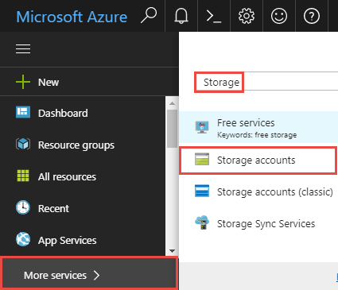
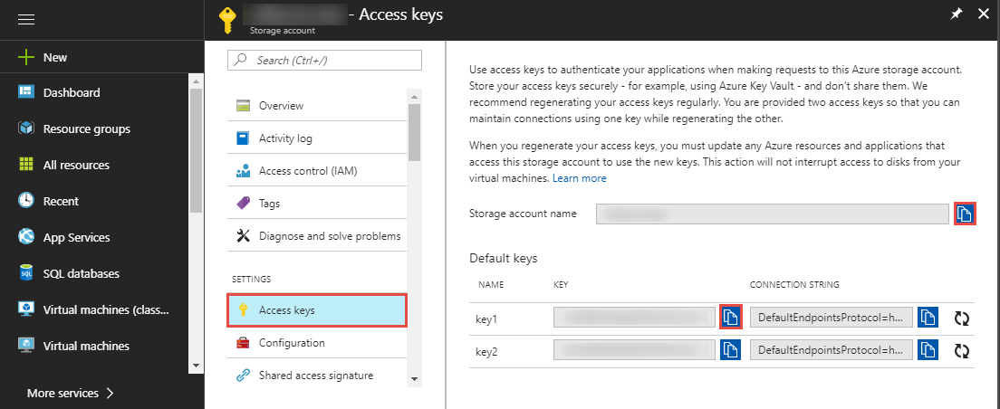
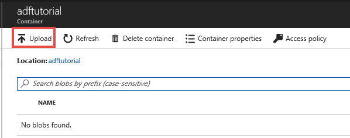
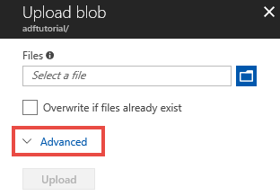
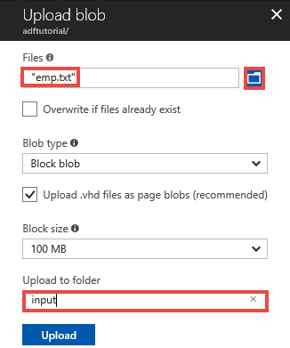
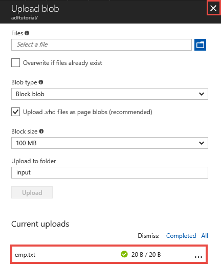

# Create an Azure data factory using PowerShell 
> [!div class="op_single_selector" title1="Select the version of Data Factory service you are using:"]
> * [Version 1 - GA](v1/data-factory-copy-data-from-azure-blob-storage-to-sql-database.md)
> * [Version 2 - Preview](quickstart-create-data-factory-powershell.md)

This quickstart describes how to use PowerShell to create an Azure data factory. The pipeline you create in this data factory copies data from one folder to another folder in an Azure blob storage. For a tutorial on how to transform data using Azure Data Factory, see [Tutorial: Transform data using Spark](transform-data-using-spark.md). 

This article does not provide a detailed introduction of the Data Factory service. For an introduction to the Azure Data Factory service, see [Introduction to Azure Data Factory](introduction.md).

> [!NOTE]
> This article applies to version 2 of Data Factory, which is currently in preview. If you are using version 1 of the Data Factory service, which is generally available (GA), see [get started with Data Factory version 1](v1/data-factory-copy-data-from-azure-blob-storage-to-sql-database.md).


## Prerequisites

### Azure subscription
If you don't have an Azure subscription, create a [free](https://azure.microsoft.com/free/) account before you begin.

### Azure roles
To create Data Factory instances, Azure user must be a member of **contributor** or **administrator** roles of the Azure subscription. For instructions, see [Add roles](../billing/billing-add-change-azure-subscription-administrator.md).

### Azure Storage Account
You use a general-purpose Azure Storage Account (specifically Blob Storage) as both **source** and **sink/destination** data store in this quickstart. If you don't have a general-purpose Azure storage account, see [Create a storage account](../storage/common/storage-create-storage-account.md#create-a-storage-account) on creating one. 

#### Get storage account name and account key
You use the name and key of your Azure storage account in this quickstart. The following procedure provides steps to get the name and key of your storage account. 

1. Launch a Web browser and navigate to [Azure portal](https://portal.azure.com). Log in using your Azure user name and password. 
2. Click **More services >** in the left menu, and filter with **Storage** keyword, and select **Storage accounts**.

    
3. In the list of storage accounts, filter for your storage account (if needed), and then select **your storage account**. 
4. In the **Storage account** page, select **Access keys** on the menu.

    
5. Copy the values for **Storage account name** and **key1** fields to the clipboard. Paste them into a notepad or any other editor and save it.  

#### Create input folder and files
In this section, you create a blob container named **adftutorial** in your Azure blob storage. Then, you create a folder named input in the container, and then upload a sample file to the input folder. 

1. In the **Storage account** page, switch to the **Overview**, and then click **Blobs**. 

    
2. In the **Blob service** page, click **+ Container** on the toolbar. 

        
3. In the **New container** dialog, enter **adftutorial** for the name, and click **OK**. 

    
4. Click **adftutorial** in the list of containers. 

    
1. In the **Container** page, click **Upload** on the toolbar.  

    
6. In the **Upload blob** page, click **Advanced**.

    
7. Launch **Notepad** and create a file named **emp.txt** with the following content: Save it in the **c:\ADFv2QuickStartPSH** folder: Create the folder **ADFv2QuickStartPSH** if it does not already exist.
    
    ```
    John, Doe
    Jane, Doe
    ```    
8. In the Azure portal, in the **Upload blob** page, browse, and select the **emp.txt** file for the **Files** field. 
9. Enter **input** as a value **Upload to folder** filed. 

        
10. Confirm that the folder is **input** and file is **emp.txt**, and click **Upload**.
11. You should see the **emp.txt** file and the status of the upload in the list. 
12. Close the **Upload blob** page by clicking **X** in the corner. 

    
1. Keep the **container** page open. You use it to verify the output at the end of this quickstart. 

### Azure PowerShell

#### Install Azure PowerShell
Install the latest Azure PowerShell if you don't have it on your machine. 

1. In your web browser, navigate to [Azure SDK Downloads and SDKS](https://azure.microsoft.com/downloads/) page. 
2. Click **Windows install** in the **Command-line tools** -> **PowerShell** section. 
3. To install Azure PowerShell, run the **MSI** file. 

For detailed instructions, see [How to install and configure Azure PowerShell](/powershell/azure/install-azurerm-ps). 

#### Log in to Azure PowerShell
Launch **PowerShell** on your machine. Keep Azure PowerShell open until the end of this quickstart. If you close and reopen, you need to run these commands again.

1. Run the following command, and enter the Azure user name and password that you use to sign in to the Azure portal:
       
    ```powershell
    Login-AzureRmAccount
    ```        
2. If you have multiple Azure subscriptions, run the following command to view all the subscriptions for this account:

    ```powershell
    Get-AzureRmSubscription
    ```
3. Run the following command to select the subscription that you want to work with. Replace **SubscriptionId** with the ID of your Azure subscription:

    ```powershell
    Select-AzureRmSubscription -SubscriptionId "<SubscriptionId>"   	
    ```

## Create a data factory
1. Define a variable for the resource group name that you use in PowerShell commands later. Copy the following command text to PowerShell, specify a name for the [Azure resource group](../azure-resource-manager/resource-group-overview.md) in double quotes, and then run the command. 
   
     ```powershell
    $resourceGroupName = "<Specify a name for the Azure resource group>";
    ```
2. Define a variable for the data factory name that you can use in PowerShell commands later. 

    ```powershell
    $dataFactoryName = "<Specify a name for the data factory. It must be globally unique.>";
    ```
1. Define a variable for the location of the data factory: 

    ```powershell
    $location = "East US"
    ```
4. To create the Azure resource group, run the following command: 

    ```powershell
    New-AzureRmResourceGroup $resourceGroupName $location
    ``` 
    If the resource group already exists, you may not want to overwrite it. Assign a different value to the `$resourceGroupName` variable and try it again. If you want to share the resource group with other, proceed to the next step. 
5. To create the data factory, run the following **Set-AzureRmDataFactoryV2** cmdlet: 
    
    ```powershell       
    Set-AzureRmDataFactoryV2 -ResourceGroupName $resourceGroupName -Location "East US" -Name $dataFactoryName 
    ```

Note the following points:

* The name of the Azure data factory must be globally unique. If you receive the following error, change the name and try again.

    ```
    The specified Data Factory name 'ADFv2QuickStartDataFactory' is already in use. Data Factory names must be globally unique.
    ```

* To create Data Factory instances, you must be a **contributor** or **administrator** of the Azure subscription.
* Currently, Data Factory version 2 allows you to create data factories only in the East US, East US2, and West Europe regions. The data stores (Azure Storage, Azure SQL Database, etc.) and computes (HDInsight, etc.) used by data factory can be in other regions.

## Create a linked service

Create linked services in a data factory to link your data stores and compute services to the data factory. In this quickstart, you only need to create one Azure Storage linked service to be used as both the source and sink stores, named "AzureStorageLinkedService" in this sample.

1. Create a JSON file named **AzureStorageLinkedService.json** in **C:\ADFv2QuickStartPSH** folder with the following content: (Create the folder ADFv2QuickStartPSH if it does not already exist.). 

    > [!IMPORTANT]
    > Replace &lt;accountName&gt; and &lt;accountKey&gt; with name and key of your Azure storage account before saving the file.

    ```json
    {
        "name": "AzureStorageLinkedService",
        "properties": {
            "type": "AzureStorage",
            "typeProperties": {
                "connectionString": {
                    "value": "DefaultEndpointsProtocol=https;AccountName=<accountName>;AccountKey=<accountKey>;EndpointSuffix=core.windows.net",
                    "type": "SecureString"
                }
            }
        }
    }
    ```

2. In **Azure PowerShell**, switch to the **ADFv2QuickStartPSH** folder.

3. Run the **Set-AzureRmDataFactoryV2LinkedService** cmdlet to create the linked service: **AzureStorageLinkedService**. 

    ```powershell
    Set-AzureRmDataFactoryV2LinkedService -DataFactoryName $dataFactoryName -ResourceGroupName $resourceGroupName -Name "AzureStorageLinkedService" -DefinitionFile ".\AzureStorageLinkedService.json"
    ```

    Here is the sample output:

    ```
    LinkedServiceName : AzureStorageLinkedService
    ResourceGroupName : <resourceGroupName>
    DataFactoryName   : <dataFactoryName>
    Properties        : Microsoft.Azure.Management.DataFactory.Models.AzureStorageLinkedService
    ```

## Create a dataset

You define a dataset that represents the data to copy from a source to a sink. In this example, this Blob dataset refers to the Azure Storage linked service you create in the previous step. The dataset takes a parameter whose value is set in an activity that consumes the dataset. The parameter is used to construct the **folderPath** pointing to where the data resides/stored.

1. Create a JSON file named **BlobDataset.json** in the **C:\ADFv2QuickStartPSH** folder, with the following content:

    ```json
    {
        "name": "BlobDataset",
        "properties": {
            "type": "AzureBlob",
            "typeProperties": {
                "folderPath": {
                    "value": "@{dataset().path}",
                    "type": "Expression"
                }
            },
            "linkedServiceName": {
                "referenceName": "AzureStorageLinkedService",
                "type": "LinkedServiceReference"
            },
            "parameters": {
                "path": {
                    "type": "String"
                }
            }
        }
    }
    ```

2. To create the dataset: **BlobDataset**, run the **Set-AzureRmDataFactoryV2Dataset** cmdlet.

    ```powershell
    Set-AzureRmDataFactoryV2Dataset -DataFactoryName $dataFactoryName -ResourceGroupName $resourceGroupName -Name "BlobDataset" -DefinitionFile ".\BlobDataset.json"
    ```

    Here is the sample output:

    ```
    DatasetName       : BlobDataset
    ResourceGroupName : <resourceGroupname>
    DataFactoryName   : <dataFactoryName>
    Structure         :
    Properties        : Microsoft.Azure.Management.DataFactory.Models.AzureBlobDataset
    ```

## Create a pipeline
  
In this example, this pipeline contains one activity and takes two parameters - input blob path and output blob path. The values for these parameters are set when the pipeline is triggered/run. The copy activity uses the same blob dataset created in the previous step as input and output. When the dataset is used as an input dataset, input path is specified. And, when the dataset is used as an output dataset, the output path is specified. 

1. Create a JSON file named **Adfv2QuickStartPipeline.json** in the **C:\ADFv2QuickStartPSH** folder with the following content:

    ```json
    {
        "name": "Adfv2QuickStartPipeline",
        "properties": {
            "activities": [
                {
                    "name": "CopyFromBlobToBlob",
                    "type": "Copy",
                    "inputs": [
                        {
                            "referenceName": "BlobDataset",
                            "parameters": {
                                "path": "@pipeline().parameters.inputPath"
                            },
                            "type": "DatasetReference"
                        }
                    ],
                    "outputs": [
                        {
                            "referenceName": "BlobDataset",
                            "parameters": {
                                "path": "@pipeline().parameters.outputPath"
                            },
                            "type": "DatasetReference"
                        }
                    ],
                    "typeProperties": {
                        "source": {
                            "type": "BlobSource"
                        },
                        "sink": {
                            "type": "BlobSink"
                        }
                    }
                }
            ],
            "parameters": {
                "inputPath": {
                    "type": "String"
                },
                "outputPath": {
                    "type": "String"
                }
            }
        }
    }
    ```

2. To create the pipeline: **Adfv2QuickStartPipeline**, Run the **Set-AzureRmDataFactoryV2Pipeline** cmdlet.

    ```powershell
    Set-AzureRmDataFactoryV2Pipeline -DataFactoryName $dataFactoryName -ResourceGroupName $resourceGroupName -Name "Adfv2QuickStartPipeline" -DefinitionFile ".\Adfv2QuickStartPipeline.json"
    ```

    Here is the sample output:

    ```
    PipelineName      : Adfv2QuickStartPipeline
    ResourceGroupName : <resourceGroupName>
    DataFactoryName   : <dataFactoryName>
    Activities        : {CopyFromBlobToBlob}
    Parameters        : {[inputPath, Microsoft.Azure.Management.DataFactory.Models.ParameterSpecification], [outputPath, Microsoft.Azure.Management.DataFactory.Models.ParameterSpecification]}
    ```

## Create a pipeline run

In this step, you set values for the pipeline parameters:  **inputPath** and **outputPath** with actual values of source and sink blob paths. Then, you create a pipeline run by using these arguments. 

1. Create a JSON file named **PipelineParameters.json** in the **C:\ADFv2QuickStartPSH** folder with the following content:

	Replace value of **inputPath** and **outputPath** with your source and sink blob path if you are using different containers and folders.

    ```json
    {
        "inputPath": "adftutorial/input",
        "outputPath": "adftutorial/output"
    }
    ```

2. Run the **Invoke-AzureRmDataFactoryV2Pipeline** cmdlet to create a pipeline run and pass in the parameter values. It also captures the pipeline run ID for future monitoring.

    ```powershell
    $runId = Invoke-AzureRmDataFactoryV2Pipeline -DataFactoryName $dataFactoryName -ResourceGroupName $resourceGroupName -PipelineName "Adfv2QuickStartPipeline" -ParameterFile .\PipelineParameters.json
    ```

## Monitor a pipeline run

1. Run the following script to continuously check the pipeline run status until it finishes copying the data.

    ```powershell
    while ($True) {
        $run = Get-AzureRmDataFactoryV2PipelineRun -ResourceGroupName $resourceGroupName -DataFactoryName $DataFactoryName -PipelineRunId $runId

        if ($run) {
            if ($run.Status -ne 'InProgress') {
                Write-Host "Pipeline run finished. The status is: " $run.Status -foregroundcolor "Yellow"
                $run
                break
            }
            Write-Host  "Pipeline is running...status: InProgress" -foregroundcolor "Yellow"
        }

        Start-Sleep -Seconds 30
    }
    ```

    Here is the sample output of pipeline run:

    ```
    Pipeline is running...status: InProgress
    Pipeline run finished. The status is:  Succeeded
    
    ResourceGroupName : ADFTutorialResourceGroup
    DataFactoryName   : SPTestFactory0928
    RunId             : 0000000000-0000-0000-0000-0000000000000
    PipelineName      : Adfv2QuickStartPipeline
    LastUpdated       : 9/28/2017 8:28:38 PM
    Parameters        : {[inputPath, adftutorial/input], [outputPath, adftutorial/output]}
    RunStart          : 9/28/2017 8:28:14 PM
    RunEnd            : 9/28/2017 8:28:38 PM
    DurationInMs      : 24151
    Status            : Succeeded
    Message           :
    ```

2. Run the following script to retrieve copy activity run details, for example, size of the data read/written.

    ```powershell
    Write-Host "Activity run details:" -foregroundcolor "Yellow"
    $result = Get-AzureRmDataFactoryV2ActivityRun -DataFactoryName $dataFactoryName -ResourceGroupName $resourceGroupName -PipelineRunId $runId -RunStartedAfter (Get-Date).AddMinutes(-30) -RunStartedBefore (Get-Date).AddMinutes(30)
    $result
    
    Write-Host "Activity 'Output' section:" -foregroundcolor "Yellow"
    $result.Output -join "`r`n"
    
    Write-Host "\nActivity 'Error' section:" -foregroundcolor "Yellow"
    $result.Error -join "`r`n"
    ```
3. Confirm that you see the output similar to the following sample output of activity run result:

    ```json
    ResourceGroupName : ADFTutorialResourceGroup
    DataFactoryName   : SPTestFactory0928
    ActivityName      : CopyFromBlobToBlob
    PipelineRunId     : 00000000000-0000-0000-0000-000000000000
    PipelineName      : Adfv2QuickStartPipeline
    Input             : {source, sink}
    Output            : {dataRead, dataWritten, copyDuration, throughput...}
    LinkedServiceName :
    ActivityRunStart  : 9/28/2017 8:28:18 PM
    ActivityRunEnd    : 9/28/2017 8:28:36 PM
    DurationInMs      : 18095
    Status            : Succeeded
    Error             : {errorCode, message, failureType, target}
    
    Activity 'Output' section:
    "dataRead": 38
    "dataWritten": 38
    "copyDuration": 7
    "throughput": 0.01
    "errors": []
    "effectiveIntegrationRuntime": "DefaultIntegrationRuntime (West US)"
    "usedCloudDataMovementUnits": 2
    "billedDuration": 14
    ```

## Verify the output
The pipeline automatically creates the output folder in the adftutorial blob container. Then, it copies the emp.txt file from the input folder to the output folder. 

1. In the Azure portal, on the **adftutorial** container page, click **Refresh** to see the output folder. 
    
    
2. Click **output** in the folder list. 
2. Confirm that the **emp.txt** is copied to the output folder. 

    

## Clean up resources
You can clean up the resources that you created in the Quickstart in two ways. You can delete the [Azure resource group](../azure-resource-manager/resource-group-overview.md), which includes all the resources in the resource group. If you want to keep the other resources intact, delete only the data factory you created in this tutorial.

Run the following command to delete the entire resource group: 
```powershell
Remove-AzureRmResourceGroup -ResourceGroupName $resourcegroupname
```

Run the following command to delete only the data factory: 

```powershell
Remove-AzureRmDataFactoryV2 -Name $dataFactoryName -ResourceGroupName $resourceGroupName
```

## Next steps
The pipeline in this sample copies data from one location to another location in an Azure blob storage. Go through the [tutorials](tutorial-copy-data-dot-net.md) to learn about using Data Factory in more scenarios. 
